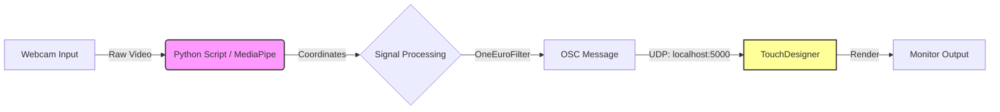

# Headset-less VR: The World Shifts As You Look Around
**CSC173 Intelligent Systems Final Project** 
*Mindanao State University - Iligan Institute of Technology* 
**Student:** Angelyn Jimeno, 2022-4037  
**Semester:** AY 2025-2026 Sem 1  
  

## Abstract
Traditional Virtual Reality (VR) relies on bulky headsets that isolate users and are impractical for casual use. This project implements **Deep Monocular Parallax**, a "Headset-less VR" system. By leveraging **Google MediaPipe Face Mesh** to track the user's head position in real-time, the system updates the camera perspective of a 3D scene (rendered in **TouchDesigner**) to create a "Window Effect" on a standard 2D monitor. This project aims to provide spatial immersion and focus enhancement without the need for wearable hardware.

## Table of Contents
- [Introduction](#introduction)
- [Related Work](#related-work)
- [Methodology](#methodology)
- [Experiments & Results](#experiments--results)
- [Discussion](#discussion)
- [Ethical Considerations](#ethical-considerations)
- [Conclusion](#conclusion)
- [Installation](#installation)
- [References](#references)

## Introduction
### Problem Statement
Standard computer interfaces are static. No matter how the user moves, the image remains flat 2D. This breaks immersion and leads to cognitive drift. While VR solves this, it requires expensive, isolating headsets that are impractical for daily study environments.

### Objectives
1.  **Face Tracking:** Implement **MediaPipe Face Mesh** to detect the user's head position and rotation (6-DoF) from a standard webcam feed.
2.  **Off-Axis Projection Logic:** Develop an algorithm that translates physical head movements into virtual camera coordinates to create the "Window Effect."
3.  **Visual Synthesis:** Use **TouchDesigner** to render a reactive "Retro-wave" 3D environment (infinite grid, mountains, sun) that responds instantly to the user's perspective.
4.  **Integration:** Establish a high-speed OSC (Open Sound Control) bridge to send tracking data from Python to TouchDesigner with minimal latency.

## Related Work

## Methodology
### Dataset & Model
- **Model:** Pre-trained **MediaPipe Face Mesh** (Google), capable of detecting 468 3D facial landmarks.
- **Input Resolution:** Webcam stream downscaled to 640x480 for optimized inference speed (target >30 FPS).
- **Coordinate System:** The model outputs normalized coordinates $(0.0 - 1.0)$, which are remapped to the 3D engine's coordinate space.

### System Architecture

### Hyperparameters
| Parameter | Value | Description |
|-----------|-------|-------------|
| Min Cutoff | 1.0 Hz | Minimum filter frequency for slow movements |
| Beta | 0.05 | Speed coefficient for the smoothing filter |
| OSC Rate | 60 Hz | Frequency of data transmission |
| Camera FOV | 60° | Field of View for the virtual camera |

## Experiments & Results
### Performance Metrics
### Visual Stability
## Discussion
## Ethical Considerations
- **Privacy:** This project follows a **Privacy by Design** approach. All computer vision processing happens locally in RAM. No video feed or biometric data is ever saved to disk or transmitted to the cloud.
- **Accessibility:** By removing the need for expensive VR headsets, this technology makes spatial computing interfaces accessible to students and users in low-resource environments.

## Conclusion
## Installation
### Prerequisites
1.  **Python 3.8+**
2.  **TouchDesigner** (Non-Commercial License)
3.  **Webcam**

### Steps
## References