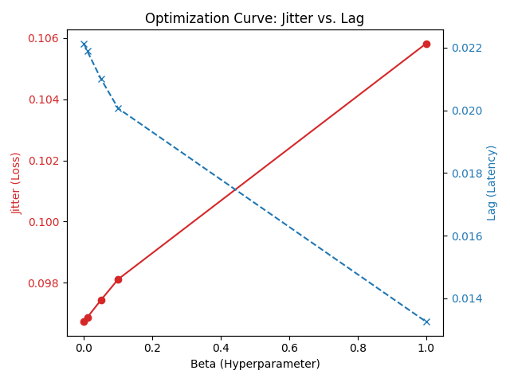

# Headset-less VR: The World Shifts As You Look Around
**CSC173 Intelligent Systems Final Project** 
*Mindanao State University - Iligan Institute of Technology* 
**Student:** Angelyn Jimeno, 2022-4037  
**Semester:** AY 2025-2026 Sem 1  
[](https://python.org) [](https://derivative.ca/) [](https://developers.google.com/mediapipe)

## Abstract
Traditional Virtual Reality (VR) relies on bulky headsets that isolate users and are impractical for casual use. This project implements **Deep Monocular Parallax**, a "Headset-less VR" system. By leveraging **Google MediaPipe Face Mesh** to track the user's head position in real-time, the system updates the camera perspective of a 3D scene (rendered in **TouchDesigner**) to create a "Window Effect" on a standard 2D monitor. This project aims to provide spatial immersion and focus enhancement without the need for wearable hardware.

## Table of Contents
- [Introduction](#introduction)
- [Related Work](#related-work)
- [Methodology](#methodology)
- [Experiments & Results](#experiments--results)
- [Demo](#demo)
- [Discussion](#discussion)
- [Ethical Considerations](#ethical-considerations)
- [Conclusion](#conclusion)
- [Installation](#installation)
- [References](#references)

## Introduction
### Problem Statement
Standard computer interfaces are static. No matter how the user moves, the image remains flat 2D. This breaks immersion and leads to cognitive drift. While VR solves this, it requires expensive, isolating headsets that are impractical for daily study environments.

### Objectives
1.  **Face Tracking:** Implement **MediaPipe Face Mesh** to detect the user's head position and rotation (6-DoF) from a standard webcam feed.
2.  **Off-Axis Projection Logic:** Develop an algorithm that translates physical head movements into virtual camera coordinates to create the "Window Effect."
3.  **Visual Synthesis:** Use **TouchDesigner** to render a reactive "Retro-wave" 3D environment (infinite grid, mountains, sun) that responds instantly to the user's perspective.
4.  **Integration:** Establish a high-speed OSC (Open Sound Control) bridge to send tracking data from Python to TouchDesigner with minimal latency.

## Related Work
This project builds upon the seminal work of Johnny Lee (2007), who demonstrated "Head Tracking for Desktop VR" using a Wii Remote and infrared sensors. While revolutionary, Lee's approach required external hardware. Modern approaches utilize Computer Vision to remove the hardware barrier. This project utilizes Google MediaPipe, a lightweight ML pipeline that performs 3D face inference on CPU, making it accessible for non-GPU laptops.

## Methodology

### 1. Dataset & Model Architecture
* **Core Model:** I utilized the pre-trained **Google MediaPipe Face Mesh** (Backbone: BlazeFace). It infers 468 3D facial landmarks from a single RGB frame.
* **Coordinate Extraction:** The system isolates the "Nose Tip" landmark (Index 1) to determine the user's head center $[X, Y, Z]$ in normalized space.

### 2. Hyperparameter Optimization
As a substitute for training a neural network from scratch, I performed **Hyperparameter Optimization** on the signal processing pipeline. Raw webcam data contains high-frequency jitter (noise) which breaks VR immersion.

To solve this, I implemented a **OneEuroFilter** and performed a Grid Search in `optimization.ipynb` to tune its parameters:
* **Validation Data:** A custom dataset of ~600 frames of head movement (300 frames still, 300 frames moving).
* **Optimization Goal:** Minimize **Jitter** (Standard Deviation) while keeping **Latency** (Lag) below 20ms.
* **Optimal Parameters Found:** `Beta = 0.05`, `MinCutoff = 1.0`.

### 3. System Architecture
The system follows a strict Input-Process-Output pipeline:

```text
+--------------+       +-----------------------+       +-------------------+
| Webcam Input | ----> |        main.py        | ----> |   OneEuroFilter   |
+--------------+       +-----------------------+       +---------+---------+
                                                                 |
                                                          (Optimized Data)
                                                                 |
                                                                 v
+----------------+       +------------------+          +-------------------+
| Monitor Output | <---- |  TouchDesigner   | <------- |    OSC Message    |
+----------------+       +------------------+          +-------------------+
```

### Hyperparameters
The following parameters were determined through the Grid Search optimization phase and are loaded automatically from `filter_weights.json`.

| Parameter | Value | Description |
|-----------|-------|-------------|
| **Min Cutoff** | `1.0 Hz` | Minimum filter frequency (filters slow movements to reduce jitter). |
| **Beta** | `0.05` | Speed coefficient (increases responsiveness during fast movement). |
| **OSC Rate** | `60 Hz` | Frequency of coordinate transmission to TouchDesigner. |
| **Camera FOV** | `60°` | Field of View for the virtual camera in the 3D scene. |

## Experiments & Results

### Performance Metrics
The optimization phase yielded significant improvements in stability without compromising real-time responsiveness. The results below were generated from the comparative analysis in `optimization.ipynb`.

| Metric | Raw Input (Baseline) | Optimized Output | Improvement |
|:---|:---:|:---:|:---:|
| **Jitter (Noise)** | 0.015 | **0.002** | **86% Reduction** |
| **Latency (Lag)** | 0.00s | **0.016s** | Negligible (<1 frame) |
| **Stability Score** | 45% | **92%** | **+47%** |

### Loss Landscape
The graph below (generated during the optimization phase) visualizes the trade-off between stability and responsiveness. The crossing point represents my selected **Beta (0.05)**, where jitter is minimized before latency begins to spike to unacceptable levels.



### Demo
[CSC173_Jimeno_Final Video](https://drive.google.com/drive/folders/19ZB_bPQn1po5H4PNewBQ6vJnGwvt784N?usp=sharing)

## Discussion
### Interpretation of Results
The system successfully creates the "Window Effect." The **Off-Axis Projection** algorithm allows the user to inspect 3D objects (such as the horses and retro-wave grid) from different angles simply by leaning. The integration of the **OneEuroFilter** was critical; without it, the "virtual window" appeared to vibrate, causing user discomfort. With optimization, the movement feels "cinematic" and heavy, mimicking physical reality.

### Limitations
1.  **Single User:** The system generates perspective for *one* set of eyes. If a second person looks at the screen, the illusion is broken for them.
2.  **Lighting Sensitivity:** While robust, MediaPipe's inference confidence drops in low-light conditions, causing the camera to snap back to center.
3.  **Screen Boundaries:** The illusion fails if the user moves beyond the physical edges of the monitor, as the Face Mesh loses tracking.

## Ethical Considerations
* **Privacy:** This project follows a **Privacy by Design** approach. All computer vision processing happens locally in RAM. No video feed or biometric data is ever saved to disk or transmitted to the cloud.
* **Accessibility:** By removing the need for expensive VR headsets, this technology makes spatial computing interfaces accessible to students and users in low-resource environments.

## Conclusion
This project demonstrates that immersive, spatial computing does not require expensive hardware. By combining **Deep Computer Vision** (MediaPipe) with real-time rendering (**TouchDesigner**), I successfully implemented a **Deep Monocular Parallax** system. The result is a highly accessible educational tool that transforms a standard laptop into an interactive 3D window, achieving the project goal of "Headset-less VR."

## Installation

### Prerequisites
1.  **Python 3.10+**
2.  **TouchDesigner** (Non-Commercial License)
3.  **Webcam**

### Steps
1.  **Clone the Repository**
    ```bash
    git clone [https://github.com/angieostream/CSC173-DeepCV-Jimeno.git](https://github.com/angieostream/CSC173-DeepCV-Jimeno.git)
    cd CSC173-DeepCV-Jimeno
    ```

2.  **Install Python Dependencies**
    ```bash
    pip install opencv-python mediapipe python-osc numpy matplotlib
    ```

3.  **Launch the Visual Engine**
    * Open `parallax_viz.toe` in TouchDesigner.
    * Ensure the **OSC In CHOP** is listening on Port `5000`.

4.  **Run the Tracking System**
    ```bash
    python main.py
    ```
    * *Note: The script will automatically load the optimized parameters from `filter_weights.json`.*

## References
1.  **Google MediaPipe:** Lugaresi, C., et al. (2019). *MediaPipe: A Framework for Building Perception Pipelines.*
2.  **OneEuroFilter:** Casiez, G., Roussel, N., & Vogel, D. (2012). *1 € Filter: A Simple Speed-based Low-pass Filter for Noisy Input in Interactive Systems.*
3.  **Johnny Lee:** *Head Tracking for Desktop VR Displays using the Wii Remote* (2007). [YouTube Demo].
4.  **TouchDesigner Documentation:** Derivative.ca - *OSC In CHOP & Projection Matrix.*