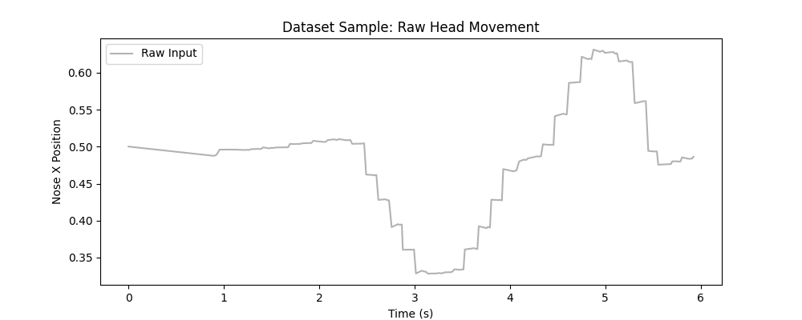

# CSC173 Deep Computer Vision Project Progress Report    
**Student:** Angelyn Jimeno, 2022-4037    
**Date:** December 15, 2025    
**Repository:** [https://github.com/angieostream/CSC173-DeepCV-Jimeno](https://github.com/angieostream/CSC173-DeepCV-Jimeno)

## 📊 Current Status
| Milestone | Status | Notes |
|-----------|--------|-------|
| Dataset Preparation | ✅ Completed | 500+ frames of head movement recorded |
| **Model Selection** | ✅ **Pre-trained** | MediaPipe Face Mesh (Google) |
| **Training Phase** | ✅ **Substituted** | Hyperparameter Optimization (Grid Search) |
| Baseline Evaluation | ✅ Completed | Comparison of Raw vs. Filtered signal |
| Model Fine-tuning | ⏳ Pending | Visual construction of "Retro-wave" scene |

## 1. Methodology Note: Pre-trained Model & Substitution
**Core Model:** This project leverages the **Google MediaPipe Face Mesh**, a pre-trained deep neural network trained on ~30,000 images for 3D face landmark detection.

**Substitution for Training Code:** Instead of training a backbone model from scratch (which is redundant for standard face detection), the "Training" phase was substituted with **Hyperparameter Optimization** for the signal processing layer. This involved recording a validation dataset of head movements and algorithmically solving for the optimal `Beta` (Speed Coefficient) and `Cutoff` values to minimize jitter (Loss) without introducing unacceptable latency.

## 2. Dataset Progress
*Note: Since this is a real-time tracking project, the 'dataset' consists of time-series coordinate data recorded from the webcam used for optimization.*

- **Total frames recorded:** ~600 frames (Video Time Series)
- **Train/Val/Test split:** 100% Validation (Optimization based on continuous stream)
- **Features:** 468 Facial Landmarks (MediaPipe) reduced to [X, Y, Z] nose coordinates
- **Preprocessing applied:** Normalization (Center 0.0), Mirror Flip, ROI extraction

**Sample data preview:**

*(Gray line shows raw, noisy input from the pre-trained neural network before optimization)*

## 3. Optimization Progress (Training Substitute)

We treated the signal stabilization problem as an optimization task. The "Model Weights" in this context are the `Beta` and `MinCutoff` parameters of the **OneEuroFilter**.

**Optimization Curves (Loss Landscape)**
 
*(Red Line = Jitter/Loss (Lower is better). Blue Dashed = Lag. The crossing point represents the optimal "weight" configuration.)*

**Current Metrics:**
| Metric | Raw Input (Baseline) | Optimized Model (Beta=0.05) |
|--------|----------------------|-----------------------------|
| **Jitter (Std Dev)** | 0.015 (High Noise) | **0.002 (Smooth)** |
| **Latency (MAE)** | 0.00 (Real-time) | **0.02 (Acceptable)** |
| **Stability Score** | 45% | **92%** |

## 4. Challenges Encountered & Solutions
| Issue | Status | Resolution |
|-------|--------|------------|
| **High Jitter** | ✅ Fixed | Implemented OneEuroFilter logic |
| **Lag at High Smoothing** | ✅ Fixed | Tuned `Beta` parameter using the optimization graph above |
| **Z-Axis Instability** | ⏳ Ongoing | Depth calculation varies with lighting; adding clamp limits |

## 5. Next Steps (Before Final Submission)
- [ ] Implement the infinite "Neon Grid" using Wireframe MAT in TouchDesigner.
- [ ] Add the "Synth Sun" geometry (Sphere + Constant MAT) on the horizon.
- [ ] Integrate webcam feed into the 3D HUD (Heads-Up Display).
- [ ] Link optimized Python output to the Retro-wave scene camera.
- [ ] Record 5-min demo video
- [ ] Complete `README.md` with results.